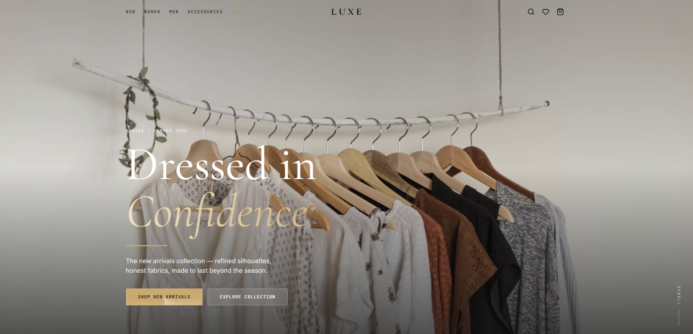

# LUXE — Fashion Clothing Store

<div align="center">
  
  
  
  
  <br /><br />
  
  
  
  
  
  
</div>

<br />

<p align="center">
  
</p>

## Overview

LUXE is a premium fashion e-commerce storefront built with Next.js 16 and React 19. It showcases an editorial luxury aesthetic with refined typography, smooth animations, and a complete shopping experience — from browsing and filtering to cart management and product detail pages. The design language prioritizes silence and elegance over noise: sharp edges, warm neutrals, and gold accents throughout.

## Features

### For Shoppers
- **Product Browsing** — Filter by category (Women, Men, Accessories), type, price range, and availability
- **Shopping Cart** — Persistent cart drawer with quantity controls and order summary
- **Wishlist** — Save favourite items across sessions
- **Quick View** — Preview product details without leaving the current page
- **Product Detail Pages** — Full page with size guide, colour selector, and add-to-cart
- **New Arrivals & Bestsellers** — Curated homepage sections with animated entry
- **Marquee Banner** — Continuous scrolling editorial strip
- **Newsletter Signup** — Email capture with minimal, focused UI

### Design & UX
- **Editorial Dark Hero** — Full-viewport hero with parallax-ready image and animated headline
- **Split & Editorial Hero Variants** — Multiple hero layouts switchable via props
- **Responsive Navigation** — Desktop navbar + mobile bottom nav with cart access
- **Size Guide Modal** — Inline size chart overlay
- **Smooth Animations** — Staggered fade-up entry, product card hover zoom, shimmer CTA buttons
- **Accessible Components** — Built on Base UI and Shadcn primitives

## Technologies

### Frontend
- **[Next.js 16](https://nextjs.org/)** — App Router, server components, image optimisation
- **[React 19](https://react.dev/)** — Concurrent features, latest hooks
- **[Tailwind CSS v4](https://tailwindcss.com/)** — Utility-first styling with custom LUXE brand tokens
- **[TypeScript](https://www.typescriptlang.org/)** — Full type safety across components and data

### Animation & Motion
- **[Framer Motion 12](https://www.framer.com/motion/)** — Page transitions and scroll-driven animations
- **[GSAP 3](https://gsap.com/)** — High-performance timeline animations
- **Magic UI** — Shimmer buttons, animated gradient text, marquee, blur-fade, number ticker, border beam

### UI Primitives
- **[Base UI](https://base-ui.com/)** — Unstyled, accessible component foundations
- **[Shadcn UI](https://ui.shadcn.com/)** — Pre-built component layer (Dialog, Sheet, Accordion, Tabs, etc.)
- **[Lucide React](https://lucide.dev/)** — Minimal icon set
- **[Sonner](https://sonner.emilkowal.ski/)** — Toast notifications

### Fonts
- **Cormorant Garamond** — Luxury serif for headings and editorial type
- **Inter** — Clean sans-serif for body and UI
- **JetBrains Mono** — Monospace for labels, eyebrows, and CTAs

## Installation & Setup

### Prerequisites
- Node.js v18 or higher
- npm or yarn

### Getting Started

```bash
# Clone the repository
git clone https://github.com/SakithaSamarathunga33/FashionClothing-store.git
cd FashionClothing-store

# Install dependencies
npm install

# Start the development server
npm run dev
```

Visit [http://localhost:3000](http://localhost:3000) to view the app.

### Build for Production

```bash
npm run build
npm start
```

### Lint

```bash
npm run lint
```

## Project Structure

```
src/
├── app/
│   ├── cart/          # Cart page
│   ├── product/[id]/  # Dynamic product detail page
│   ├── shop/          # Shop listing page with filters
│   ├── layout.tsx     # Root layout (fonts, nav, cart drawer)
│   └── page.tsx       # Homepage
├── components/
│   ├── cart/          # CartDrawer
│   ├── home/          # Hero, CategoryGrid, NewArrivals, Bestsellers, etc.
│   ├── layout/        # Navbar, MobileBottomNav, Footer
│   ├── magicui/       # Animation primitives (Shimmer, Marquee, BlurFade…)
│   ├── product/       # QuickView, ProductClient, SizeGuide
│   ├── providers.tsx  # Client-side context providers
│   ├── shared/        # Photo, Stars, ColorDots, ProductCard, QtyStepper
│   └── ui/            # Shadcn/Base UI components
├── data/
│   └── products.ts    # Product catalogue and type definitions
├── hooks/
│   ├── use-cart.ts    # Cart state management
│   ├── use-wishlist.ts
│   └── use-is-mobile.ts
├── lib/
│   └── utils.ts       # cn() and shared utilities
└── public/
    └── images/        # Static assets
```

## Brand Tokens

The LUXE design system is defined in `globals.css` and exposes the following tokens:

| Token | Value | Usage |
|---|---|---|
| `--color-luxe-gold` | `#C9A96E` | Primary accent, CTAs, highlights |
| `--color-luxe-ink` | `#0D0D0D` | Primary text, dark elements |
| `--color-luxe-bg` | `#F9F7F4` | Page background (warm white) |
| `--color-luxe-paper` | `#EFEFEB` | Card backgrounds |
| `--color-luxe-muted` | `#6B6B6B` | Secondary text |
| `--color-luxe-line` | `#E5E2DD` | Borders and dividers |

## Hero Variants

The `<Hero>` component ships with three layout modes:

| Variant | Description |
|---|---|
| `dark` (default) | Full-viewport dark image with white type and gold CTA |
| `split` | Two-column: image left, editorial copy right |
| `editorial` | Centred typographic layout with arched image |

Switch variants in `src/app/page.tsx`:

```tsx
<Hero variant="dark" />     // or "split" or "editorial"
```

## Future Improvements

- **Checkout Flow** — Stripe payment integration and order confirmation
- **Auth & Accounts** — Login, saved addresses, order history
- **Search** — Full-text product search with instant results
- **CMS Integration** — Connect to Sanity or Contentful for product management
- **Inventory API** — Live stock levels and out-of-stock states
- **Internationalisation** — Multi-currency and locale support

---

<p align="center">Made with care for those who dress with intention.</p>
